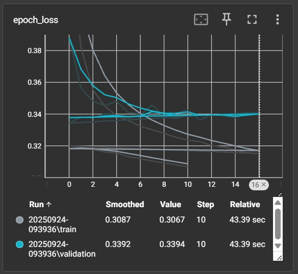
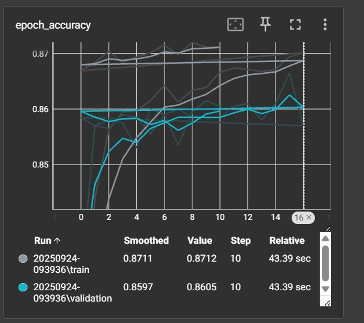

<h1 align="center">📊 Customer Churn Prediction using ANN</h1>
<p align="center">
  A Deep Learning project using <b>TensorFlow & Keras</b> to predict customer churn.  
  Deployed as an interactive <b>Streamlit Web App</b> for real-time predictions.
</p>
<p align="center">
  🔗 <a href="https://churn-prediction-by-yug.streamlit.app/"><b>Live Demo</b></a> | 
  💻 <a href="https://github.com/Yugthakkar/Churn-Prediction-using-ANN"><b>GitHub Repo</b></a>
</p>

---

<!-- Overview -->
<h2>📌 Project Overview</h2>

Customer churn is one of the biggest challenges in industries like telecom, banking, and SaaS.  
This project predicts **customer churn** (whether a customer is likely to leave a service) using an **Artificial Neural Network (ANN)**.  

✅ Businesses can use this model to improve **customer retention strategies**.  
✅ Deployed as an **interactive Streamlit web app** for easy use.  

---

<!-- Features -->
<h2>🚀 Features</h2>

- 🔹 Data preprocessing & feature engineering  
- 🔹 ANN model built with **TensorFlow/Keras**  
- 🔹 Evaluation with accuracy metrics  
- 🔹 **Deployed on Streamlit** for real-time predictions  

---

<!-- Tech Stack -->
<h2>⚙️ Tech Stack</h2>
<ul>
  <li>Python</li>
  <li>TensorFlow / Keras</li>
  <li>NumPy & Pandas</li>
  <li>Matplotlib (Visualization)</li>
  <li>Streamlit (Web App)</li>
</ul

---

<!-- Workflow -->
<h2>⚡ Project Workflow</h2>

<details>
  <summary>Click to Expand 📂</summary>
  <ol>
    <li>Data Cleaning & Preprocessing</li>
    <li>Exploratory Data Analysis (EDA)</li>
    <li>Train-Test Split</li>
    <li>Building ANN with TensorFlow/Keras</li>
    <li>Model Training & Evaluation</li>
    <li>Deployment with Streamlit</li>
  </ol>
</details>

---
---

<h2>📊 Model Performance</h2>

<p align="center">
  <b>Training vs Validation Loss</b><br>
  
</p>

<p align="center">
  <b>Training vs Validation Accuracy</b><br>
  
</p>

---

<h2>📈 Final Accuracy</h2>

- **Training Accuracy:** ~87.1%  
- **Validation Accuracy:** ~85.9%  
- **Training Loss:** ~0.30  
- **Validation Loss:** ~0.33  

The model achieves good generalization with minimal overfitting.  

---

<!-- Run Locally -->
<h2>💻 Run Locally</h2>

```bash
# Clone the repository
git clone https://github.com/Yugthakkar/Churn-Prediction-using-ANN.git

# Navigate into the folder
cd Churn-Prediction-using-ANN

# Install dependencies
pip install -r requirements.txt

# Run the Streamlit app
streamlit run app.py
